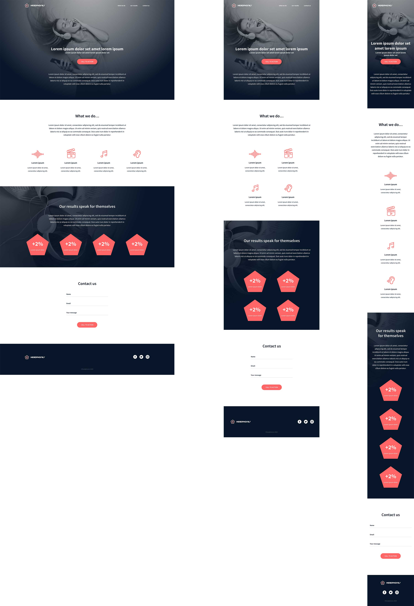

In this project, I will implement from scratch, without any library, a web page. 
I will use all HTML/CSS/Accessibility/Responsive design knowledges that I learned previously and tackle this problem.
The finished webpage must be responsive in all devices (Laptops, tablets, mobile phones, etc.).

